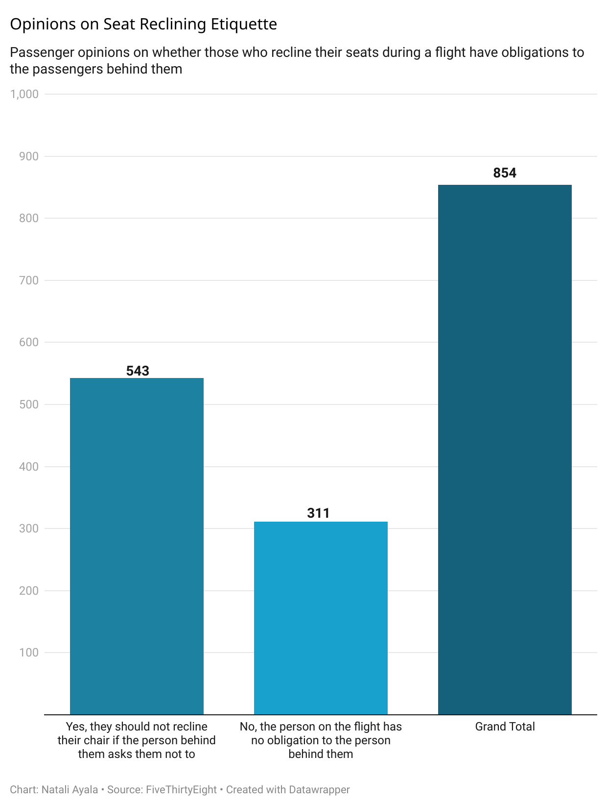

# Journal124

Question #6 Creating a repository 

## Answering questions on dataset

I picked the following question, "Under normal circumstances, does a person who reclines their seat during a flight have any obligation to the person sitting behind them?" because it seemed like the most intresting. I came in thinking most people would agree to be more delicate for others which still is true making the majority of answers, but it only makes **63.6 %** of the total. While the rest would agree that they have an obligation to the person behind, making up  **36.4%**.

 
